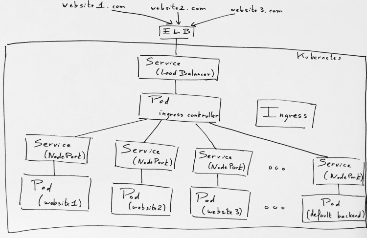

Ingress gives you a way to route requests to services based on the request host or path, centralizing a number of services into a single entrypoint (or in this case, load balancer).

### Ingress Resources

Ingress is split up into two main pieces. The first is an Ingress resource, which defines how you want requests routed to the backing services.

For example, a definition that defines an Ingress to handle requests for www.mysite.com and forums.mysite.com and routes them to the Kubernetes services named website and forums respectively would look like:

```
apiVersion: extensions/v1beta1
kind: Ingress
metadata:
  name: my-ingress
spec:
  rules:
  - host: www.mysite.com
    http:
      paths:
      - backend:
          serviceName: website
          servicePort: 80
  - host: forums.mysite.com
    http:
      paths:
      - path:
        backend:
          serviceName: forums
          servicePort: 80
```



Here is where things seem to get confusing, though. Ingress on its own doesn't really do anything. You need something to listen to the Kubernetes API for Ingress resources and then handle requests that match them. This is where the second piece to the puzzle comes in — the Ingress Controller.

Ingress Controllers can technically be any system capable of reverse proxying, but the most common is Nginx. A full example Nginx Ingress Controller (and LoadBalancer service) is as follows. Please note that if you are not on a provider that supports LoadBalancer services (ie. bare-metal), you can create a NodePort Service instead and point to your nodes with an alternative solution that fills that role — a reverse proxy capable of routing requests to the exposed NodePort for the Ingress Controller on each of your nodes.


For purpose of this lab,  Ingress Controller has already been created. 


To test things out, you need to get your Ingress Controller entrypoint.


`kubectl create -f demo-ing.yaml`


For LoadBalancer services that will be:

`kubectl get service ingress-nginx -o wide`
